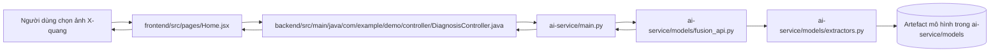

# Luồng chẩn đoán 1 ảnh X-quang

Tài liệu này mô tả một luồng chạy cụ thể khi web nhận 1 ảnh X-quang và trả về kết quả chẩn đoán viêm phổi. Mục tiêu là chỉ rõ file nào được gọi, dữ liệu đi như thế nào, và kết quả cuối cùng xuất hiện ở đâu.

## 1. Luồng tổng quát

Luồng chuẩn, đầy đủ nhất của hệ thống là:



Ý chính:

- Frontend chỉ thu ảnh và gửi request.
- Backend nhận request, lưu lịch sử, rồi gọi AI service.
- AI service trích đặc trưng và chạy mô hình đã train.
- Kết quả trả về dưới dạng JSON để frontend hiển thị.

## 2. Các file được gọi theo thứ tự

### Bước 1: Giao diện chọn ảnh

File: `frontend/src/pages/Home.jsx`

Đây là màn hình người dùng dùng để chẩn đoán.

Khi người dùng chọn 1 ảnh X-quang:

1. Ảnh được lưu tạm trong state `selectedFile`.
2. Ảnh xem trước được hiển thị bằng `URL.createObjectURL(file)`.
3. Khi bấm chẩn đoán, component tạo `FormData` với key `file`.
4. Nếu đang đăng nhập, component gửi request đến backend qua `POST /api/diagnosis/predict`.
5. Nếu không có token, component có thể gọi thẳng AI service qua `POST /predict`.

Đoạn quyết định đường đi nằm trong `handlePredict()` của file này.

### Bước 2: Backend nhận ảnh và điều phối

File: `backend/src/main/java/com/example/demo/controller/DiagnosisController.java`

Endpoint chính: `POST /api/diagnosis/predict`

Khi backend nhận ảnh:

1. Đọc file upload từ `MultipartFile file`.
2. Kiểm tra `Authorization` header để lấy user ID.
3. Lưu ảnh vào thư mục `backend/uploads/`.
4. Tạo multipart request mới để gọi AI service.
5. Gọi lần lượt các URL AI service dự phòng bằng `RestTemplate`.
6. Nhận JSON trả về từ AI service.
7. Lưu một bản ghi vào database trong `DiagnosisHistory`.
8. Trả kết quả gọn về cho frontend.

Nếu AI service trả lỗi, backend sẽ thử URL dự phòng. Nếu vẫn thất bại thì trả lỗi `AI service unreachable`.

### Bước 3: AI service nhận request chẩn đoán

File: `ai-service/main.py`

Endpoint chính: `POST /predict`

Khi backend hoặc frontend gọi AI service:

1. AI service mở ảnh upload bằng `PIL.Image.open(...).convert("RGB")`.
2. Đọc model được chọn qua tham số `model` hoặc biến môi trường `PREFERRED_MODEL`.
3. Trích sẵn đặc trưng từ ảnh.
4. Chọn nhánh dự đoán phù hợp.
5. Trả về JSON chứa nhãn dự đoán và xác suất.

Các nhánh dự đoán được ưu tiên theo thứ tự:

- `gated_fusion`
- `vit`
- `densenet`

### Bước 4: Nạp mô hình và chạy inference fusion

File: `ai-service/models/fusion_api.py`

Class chính: `FusionModelManager`

File này làm 3 việc lớn:

1. Nạp artefact đã train.
2. Tiền xử lý đặc trưng.
3. Chạy mô hình Gated Fusion và classifier cuối.

Các file model được nạp gồm:

- `ai-service/models/pca_vit.pkl`
- `ai-service/models/pca_wst.pkl`
- `ai-service/models/scaler_radsta.pkl`
- `ai-service/models/scaler_vit.pkl`
- `ai-service/models/scaler_wst.pkl`
- `ai-service/models/gated_fusion_model.pth`
- `ai-service/models/lr_classifier_gf.pkl`

Hai file `scaler_vit.pkl` và `scaler_wst.pkl` hiện có trong thư mục model của dự án và được backend/AI service ưu tiên nạp khi tồn tại. Cụm "nếu có" chỉ nhằm phản ánh cơ chế code có thể fallback nếu một artifact thiếu, chứ không phải vì mô hình hiện tại không chắc chắn về chúng.

Luồng chạy trong `predict_gf()`:

1. Gọi `preprocess_features()` để scale và PCA đặc trưng.
2. Đổi dữ liệu sang tensor PyTorch.
3. Chạy mạng `GatedFusion` để lấy fused feature.
4. Đưa fused feature vào `lr_classifier_gf.pkl`.
5. Lấy kết quả `predict()` và `predict_proba()`.

### Bước 5: Trích đặc trưng từ ảnh

File: `ai-service/models/extractors.py`

File này sinh ra các nhóm đặc trưng từ ảnh:

- ViT features
- WST features
- Radiomics features
- Statistical features

Trong nhánh Gated Fusion, đây là bước rất quan trọng vì nó tạo đầu vào cho mô hình.

Nếu `pyradiomics` không được cài, hàm vẫn trả về vector radiomics rỗng đúng kích thước, nên luồng dự đoán vẫn chạy tiếp được.

## 3. Luồng xử lý cụ thể khi người dùng bấm chẩn đoán

### 3.1 Trên frontend

File: `frontend/src/pages/Home.jsx`

Khi bấm nút chẩn đoán:

1. `handlePredict()` tạo `FormData` chứa ảnh.
2. Nếu có model đã chọn, gửi thêm trường `model`.
3. Gửi request tới backend hoặc AI service.
4. Đợi JSON trả về.
5. Nếu có `gradcamPath` hoặc `gradcam_base64`, frontend hiển thị ảnh giải thích.
6. Nếu chưa có Grad-CAM trong response, frontend gọi thêm endpoint Grad-CAM riêng.

### 3.2 Trên backend

File: `backend/src/main/java/com/example/demo/controller/DiagnosisController.java`

Backend làm nhiệm vụ trung gian:

1. Nhận file từ frontend.
2. Lưu ảnh vật lý vào `backend/uploads/`.
3. Gọi AI service bằng multipart request.
4. Chuyển JSON phản hồi sang đối tượng Java.
5. Lưu kết quả vào `DiagnosisHistory`.
6. Nếu có Grad-CAM, lưu thêm đường dẫn ảnh Grad-CAM.
7. Trả JSON cuối cùng cho frontend.

### 3.3 Trên AI service

File: `ai-service/main.py` + `ai-service/models/fusion_api.py` + `ai-service/models/extractors.py`

AI service xử lý như sau:

1. Đọc ảnh đầu vào.
2. Trích ViT/WST/radiomics/statistics.
3. Nạp bộ scaler/PCA và model fusion.
4. Sinh fused feature.
5. Classifier cuối dự đoán lớp `Normal` hoặc `Pneumonia`.
6. Tính xác suất cho 2 lớp.
7. Trả về JSON ví dụ:

```json
{
  "model": "gated_fusion",
  "label": "Pneumonia",
  "confidence": 0.933,
  "probabilities": {
    "normal": 0.067,
    "pneumonia": 0.933
  }
}
```

## 4. Kết quả cuối cùng xuất hiện ở đâu

Kết quả dự đoán cuối cùng sẽ đi theo chuỗi:

1. AI service trả JSON cho backend.
2. Backend lưu vào database.
3. Backend trả response cho frontend.
4. Frontend hiển thị:
   - nhãn dự đoán
   - độ tin cậy
   - tên model
   - ảnh Grad-CAM nếu có

Kết quả được người dùng nhìn thấy sẽ thường có dạng:

- `Normal` hoặc `Pneumonia`
- phần trăm confidence
- ảnh heatmap giải thích vùng nghi ngờ

## 5. Một lượt gọi đầy đủ sẽ chạm tới các file nào

Nếu đi theo luồng chẩn đoán đầy đủ, các file chính được gọi là:

1. `frontend/src/pages/Home.jsx`
2. `backend/src/main/java/com/example/demo/controller/DiagnosisController.java`
3. `ai-service/main.py`
4. `ai-service/models/fusion_api.py`
5. `ai-service/models/extractors.py`
6. Các artefact trong `ai-service/models/`

## 6. Tóm tắt ngắn để đưa vào báo cáo

Khi người dùng tải một ảnh X-quang lên giao diện, frontend gửi ảnh đến backend, backend lưu ảnh và chuyển tiếp sang AI service. AI service trích xuất đặc trưng từ ảnh, nạp mô hình Gated Fusion cùng classifier đã huấn luyện, sau đó trả về nhãn dự đoán và xác suất hai lớp. Backend lưu kết quả chẩn đoán vào cơ sở dữ liệu rồi trả JSON cuối cùng cho frontend để hiển thị kết quả và Grad-CAM.
