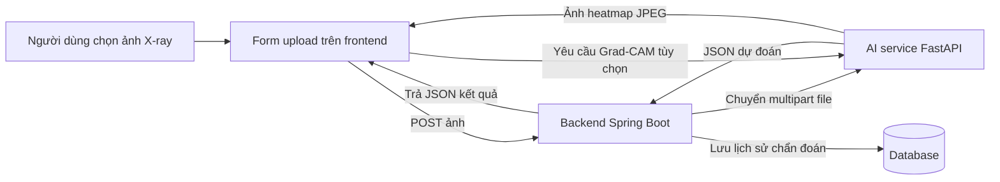

# Hướng dẫn pipeline chẩn đoán

Tài liệu này mô tả toàn bộ luồng chẩn đoán của hệ thống phát hiện viêm phổi, từ lúc người dùng tải ảnh lên giao diện cho đến khi có kết quả dự đoán, Grad-CAM, lưu lịch sử và hiển thị kết quả.

## 1. Mục tiêu của pipeline

Luồng chẩn đoán được thiết kế để trả lời 4 câu hỏi trong một lần chạy:

1. Ảnh X-quang thuộc lớp nào: Normal hay Pneumonia?
2. Mức độ tin cậy của mô hình là bao nhiêu?
3. Vì sao mô hình đưa ra quyết định đó?
4. Kết quả được lưu lại như thế nào để xem lại sau?

Hệ thống được chia thành 3 lớp chạy chính:

- Frontend: React + Vite, chủ yếu là `frontend/src/pages/Home.jsx` và `frontend/src/components/GradCAMVisualization.jsx`
- Backend: Spring Boot, chủ yếu là `backend/src/main/java/com/example/demo/controller/DiagnosisController.java`
- AI Service: FastAPI, chủ yếu là `ai-service/main.py` và `ai-service/models/fusion_api.py`

## 2. Kiến trúc tổng quan

Thực tế có 2 kiểu tương tác:

- Gọi AI trực tiếp từ trang Home để chẩn đoán nhanh.
- Đi qua backend để xác thực, lưu trữ và quản lý lịch sử.

## 3. Điểm vào ở frontend

### 3.1 Luồng chẩn đoán ở trang Home

File: `frontend/src/pages/Home.jsx`

Đây là màn hình chẩn đoán chính của người dùng. Trình tự xử lý là:

1. Người dùng chọn ảnh X-quang.
2. Ảnh được xem trước bằng `URL.createObjectURL(file)`.
3. Khi bấm chẩn đoán, component tạo payload `FormData` với key `file`.
4. Component gửi file tới endpoint AI service `POST /predict`.
5. Nếu dự đoán thành công, giao diện lưu:
   - `label`
   - `confidence`
   - `model`
   - `timestamp`
6. Sau đó trang tiếp tục gọi `POST /api/gradcam` để lấy ảnh heatmap.
7. Blob trả về được chuyển thành object URL và hiển thị bên dưới kết quả.

Điểm quan trọng:

- Trang này gọi trực tiếp tới URL AI service từ `AI_SERVICE_URL`, mặc định là `http://localhost:8000`.
- Nếu request thất bại, giao diện sẽ hiện thông báo lỗi kiểu “không thể kết nối với máy chủ AI”.

### 3.2 Component hiển thị Grad-CAM

File: `frontend/src/components/GradCAMVisualization.jsx`

Component này chỉ tập trung vào phần giải thích bằng heatmap, không xử lý toàn bộ lịch sử chẩn đoán.

Luồng đơn giản hơn:

1. Chọn ảnh.
2. Hiển thị ảnh gốc.
3. Gửi file đến `POST /api/diagnosis/gradcam` trên backend.
4. Backend chuyển file tới AI service.
5. AI service trả về ảnh Grad-CAM dạng JPEG.
6. Frontend hiển thị ảnh heatmap đó.

Component này lấy token từ `localStorage` và gửi kèm header `Authorization: Bearer ...`.

## 4. Điều phối chẩn đoán ở backend

File: `backend/src/main/java/com/example/demo/controller/DiagnosisController.java`

Spring Boot backend là lớp điều phối cho toàn bộ quy trình chẩn đoán chính thức.

### 4.1 Trách nhiệm chính

Controller thực hiện 5 việc:

1. Kiểm tra JWT token.
2. Lấy thông tin user từ token.
3. Lưu ảnh upload vào `backend/uploads/`.
4. Gọi AI service và xử lý danh sách URL dự phòng.
5. Lưu kết quả chẩn đoán vào database.

### 4.2 Endpoint dự đoán

Endpoint: `POST /api/diagnosis/predict`

Luồng xử lý của backend:

1. Nhận ảnh upload và header `Authorization`.
2. Lấy user ID từ JWT.
3. Từ chối request nếu token thiếu hoặc không hợp lệ.
4. Tải `User` từ database.
5. Lưu file vào đường dẫn cố định, ví dụ:
   - `D:/TieuLuan/pneumonia-diagnosis-system/backend/uploads/<timestamp>_<original_name>`
6. Tạo multipart request body với file.
7. Thử URL dự đoán chính của AI service trước.
8. Nếu thất bại hoặc trả lỗi, thử các URL dự phòng.
9. Phân tích JSON trả về từ AI.
10. Lấy `label`, `confidence`, và `model`.
11. Lưu một bản ghi `DiagnosisHistory`.
12. Trả response gọn cho frontend.

### 4.3 Vì sao cần URL dự phòng

Backend không tin vào chỉ một endpoint AI duy nhất vì:

- AI service có thể đang chạy trên cổng chuẩn.
- Một process cũ có thể đang chiếm cổng.
- Service có thể có endpoint thay thế.
- Kết nối hoặc khởi động chậm có thể làm URL đầu tiên thất bại tạm thời.

Backend chỉ chấp nhận response khi payload AI hợp lệ và không chứa trường `error`.

### 4.4 Endpoint Grad-CAM

Endpoint: `POST /api/diagnosis/gradcam`

Endpoint này tách riêng với dự đoán vì kiểu dữ liệu trả về khác nhau.

Prediction trả về JSON.
Grad-CAM trả về ảnh.

Luồng xử lý:

1. Nhận file upload.
2. Chuyển file tới endpoint Grad-CAM của AI service.
3. Mong đợi response là JPEG binary.
4. Nếu AI service trả JSON hoặc body lỗi thay vì ảnh, backend sẽ trả lỗi rõ ràng.
5. Nếu hợp lệ, backend chuyển tiếp luồng JPEG cho frontend.

## 5. Pipeline suy luận của AI service

File: `ai-service/main.py`

Đây là lớp suy luận chính, chứa logic machine learning thực sự.

### 5.1 Hành vi khi khởi động

Trước khi phục vụ request, service sẽ:

1. Khởi tạo logging.
2. Sửa tương thích giữa NumPy và TensorFlow.
3. Import PIL, NumPy, TensorFlow/Keras, Joblib, OpenCV.
4. Nạp các helper trích xuất đặc trưng.
5. Nạp fusion model manager.
6. Nạp DenseNet, Logistic Regression, và scaler.
7. Kiểm tra xem đã có một AI instance khỏe mạnh đang chạy trên cổng 8000 chưa.
8. Nếu có thì tái sử dụng instance đó.
9. Nếu chưa thì mới khởi động FastAPI app.

Điều này quan trọng vì hệ thống được thiết kế để giữ `8000` là cổng AI canonical.

### 5.2 Endpoint dự đoán

Endpoint: `POST /predict`

Luồng dự đoán của AI service theo kiểu fallback nhiều tầng:

1. Mở ảnh upload và chuyển sang RGB.
2. Trích xuất các nhóm đặc trưng:
   - ViT features
   - WST features
   - Radiomics features
   - Statistical features
3. Ưu tiên nhánh Gated Fusion nếu fusion manager sẵn sàng.
4. Nếu fusion có sẵn, tạo dự đoán và xác suất từ fused features.
5. Nếu không có fusion, dùng RandomForest baseline.
6. Nếu nhánh đó lỗi, dùng ViT + Logistic Regression cũ.
7. Nếu vẫn lỗi, rơi xuống DenseNet.
8. Trả về JSON gồm `model`, `label`, `confidence` và xác suất các lớp.

### 5.3 Vì sao có nhiều nhánh model

Hệ thống giữ nhiều đường suy luận vì mỗi đường giải quyết một vấn đề vận hành khác nhau:

- Gated Fusion là pipeline nâng cao được kỳ vọng dùng chính.
- RandomForest là baseline ổn định.
- ViT + Logistic Regression là đường tương thích với phiên bản cũ.
- DenseNet là fallback khẩn cấp cuối cùng.

Cách này làm service bền hơn khi thiếu artifact hoặc một nhánh bị lỗi khi nạp.

### 5.4 Endpoint Grad-CAM

Endpoints: `POST /gradcam` và `POST /api/gradcam`

Grad-CAM dùng DenseNet và helper `predict_with_gradcam`.

Luồng xử lý:

1. Nhận ảnh upload.
2. Đọc ảnh và chuyển sang NumPy.
3. Sinh Grad-CAM trên DenseNet.
4. Tạo ảnh heatmap chồng lên ảnh gốc.
5. Mã hóa kết quả thành JPEG bằng OpenCV.
6. Trả raw image bytes cho bên gọi.

AI service chủ ý trả ảnh nhị phân ở đây vì frontend cần hiển thị trực tiếp phần giải thích.

### 5.5 Health check và chẩn đoán

Endpoints:

- `/health`
- `/status`

Hai endpoint này giúp backend và script khởi động kiểm tra AI service trước khi gửi request chẩn đoán.

## 6. Lớp fusion model

File: `ai-service/models/fusion_api.py`

File này nạp và quản lý pipeline fusion nhiều đặc trưng.

### 6.1 Những gì được nạp

`FusionModelManager` nạp:

- PCA cho ViT features
- PCA cho WST features
- StandardScaler cho radiomics + statistics
- Trọng số mạng Gated Fusion
- Classifier cho fused features
- Artifact RandomForest baseline

### 6.2 Nhánh dự đoán Gated Fusion

Khi nhánh fusion hoạt động:

1. ViT features được giảm chiều bằng PCA.
2. WST features được giảm chiều bằng PCA.
3. Radiomics và statistical features được ghép lại.
4. Mạng Gated Fusion kết hợp các luồng đặc trưng.
5. Biểu diễn sau fusion được đưa vào classifier.
6. Hệ thống trả ra dự đoán lớp và xác suất.

### 6.3 Nhánh dự phòng RandomForest

Nếu nhánh gated fusion không sẵn sàng:

1. ViT và WST được giảm chiều bằng PCA.
2. Radiomics và stats được scale.
3. Tất cả block đặc trưng được ghép lại.
4. RandomForest dự đoán lớp cuối cùng.
5. Xác suất được trả lại cho tầng API.

## 7. Lưu kết quả

Sau khi backend nhận được response hợp lệ từ AI:

1. Tạo object `DiagnosisHistory`.
2. Gắn user hiện tại.
3. Lưu đường dẫn ảnh.
4. Lưu nhãn dự đoán.
5. Lưu confidence.
6. Lưu timestamp tạo bản ghi.
7. Ghi vào database.

Đây là nền tảng cho các màn hình:

- lịch sử chẩn đoán
- lịch sử có review
- thống kê chẩn đoán

## 8. Luồng dữ liệu end-to-end

### 8.1 Luồng dự đoán

1. Người dùng tải ảnh X-quang lên.
2. Frontend gửi file đi.
3. Backend xác thực user và lưu file upload.
4. Backend chuyển ảnh tới AI service.
5. AI service trích xuất đặc trưng và suy luận.
6. AI service trả JSON dự đoán.
7. Backend phân tích kết quả và lưu lịch sử chẩn đoán.
8. Frontend hiển thị label, confidence và tên model.

### 8.2 Luồng Grad-CAM

1. Người dùng chọn ảnh hoặc bấm tạo phần giải thích.
2. Frontend gửi file tới endpoint Grad-CAM.
3. Backend chuyển request sang AI service.
4. AI service tạo heatmap bằng DenseNet.
5. AI service trả ảnh JPEG.
6. Frontend hiển thị ảnh trực quan.

## 9. Xử lý lỗi

Pipeline có nhiều lớp phòng vệ:

- JWT thiếu hoặc sai sẽ bị chặn sớm.
- Backend thử nhiều URL AI thay vì phụ thuộc một URL duy nhất.
- AI service ghi health status trước khi nhận traffic.
- AI service rơi qua nhiều model path khi lỗi.
- Endpoint Grad-CAM trả lỗi rõ nếu sinh ảnh thất bại.
- Frontend hiện thông báo dễ hiểu nếu không gọi được AI server.

## 10. Ý nghĩa thực tế của từng lớp

### Frontend

- Xử lý tương tác người dùng.
- Hiển thị preview và kết quả.
- Gửi file upload.

### Backend

- Chịu trách nhiệm xác thực.
- Chịu trách nhiệm lưu trữ.
- Bảo vệ AI service bằng một API ổn định.

### AI service

- Chịu trách nhiệm suy luận.
- Chịu trách nhiệm trích xuất đặc trưng.
- Chịu trách nhiệm tạo Grad-CAM.

### Fusion manager

- Chịu trách nhiệm ghép nhiều đặc trưng.
- Chọn đường suy luận mạnh nhất đang sẵn có.

## 11. Xem code ở đâu

- [frontend/src/pages/Home.jsx](../frontend/src/pages/Home.jsx)
- [frontend/src/components/GradCAMVisualization.jsx](../frontend/src/components/GradCAMVisualization.jsx)
- [frontend/src/config/api.js](../frontend/src/config/api.js)
- [backend/src/main/java/com/example/demo/controller/DiagnosisController.java](../backend/src/main/java/com/example/demo/controller/DiagnosisController.java)
- [ai-service/main.py](../ai-service/main.py)
- [ai-service/models/fusion_api.py](../ai-service/models/fusion_api.py)

## 12. Tóm tắt ngắn
+
+Luồng chẩn đoán là:
+
+Frontend upload -> Backend xác thực và lưu trữ -> AI suy luận -> Grad-CAM tùy chọn -> Lưu lịch sử -> Hiển thị kết quả.
+
+Điểm thiết kế quan trọng nhất là AI service luôn được giữ trên cổng `8000` như endpoint suy luận chuẩn, còn backend là lớp nghiệp vụ và lưu trữ ổn định.
